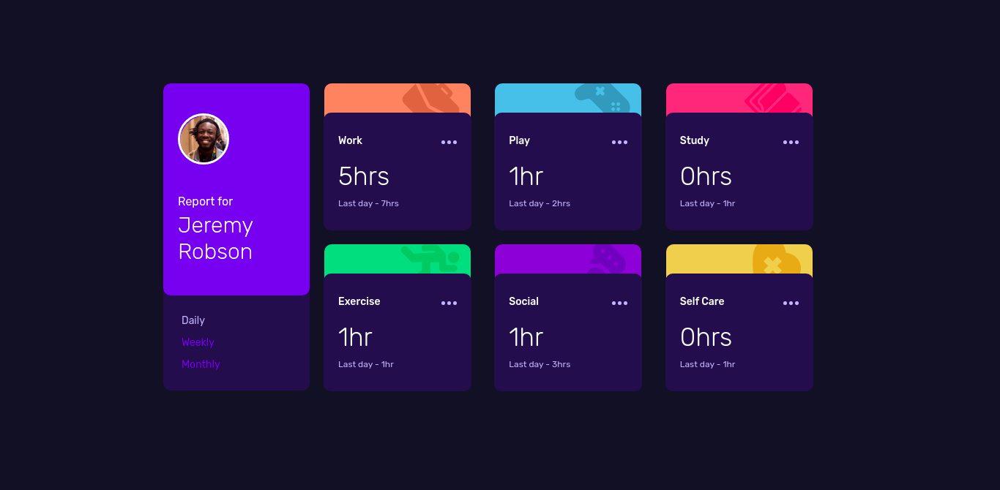
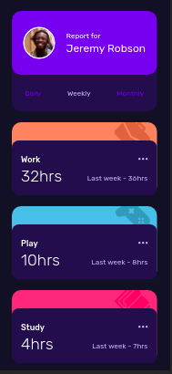

# Time Tracking Dashboard

É uma maneira de você trackear os principais momentos da sua vida, e ter um controle maior do que você faz.
Quem nunca parou para pensar quanto tempo está passando fazendo certas tarefas enquanto faz pouco de outros? 
Esse sistema pode te auxiliar a visualizar melhor suas principais atividades.

Visite você mesmo o protótipo: https://bruno3du.github.io/time-tracking-dashboard/

## Desktop

## Mobile

  

### Feito com:

- HTML 5 semantico 
- CSS customizado
- Flexbox
- CSS Grid
- Mobile-first workflow
- JavaScript
- Consumo de API

### Oque eu aprendi

Consumir API com JavaScript puro, a famigerada, Vanila JS. Criar estrutura a qual vai ser consumida dentro das especificidade da linguagem. O que é um desafio, já que tem que construir alguns de seus elementos do zero, sem nenhuma biblioteca para auxiliar.

Aprimorar minhas habilidades em CSS Grid e Flexbox para construir uma tela resposiva e bela, podendo dar vida a criatividade que o designer desenhou.

## Author

- Frontend Mentor - [@bruno3du](https://www.frontendmentor.io/profile/bruno3du)
- Linkedin - [Bruno Eduardo](https://www.linkedin.com/in/bruno-3du/)

# Frontend Mentor - Time tracking dashboard solution

Essa é uma solução para [Time tracking dashboard challenge on Frontend Mentor](https://www.frontendmentor.io/challenges/time-tracking-dashboard-UIQ7167Jw). Frontend Mentor challenges te ajuda a aprimorar suas habilidade em programação, dando-lhe design gratuitamente para você pensar apenas em explorar a sua arte em desenvolver.
